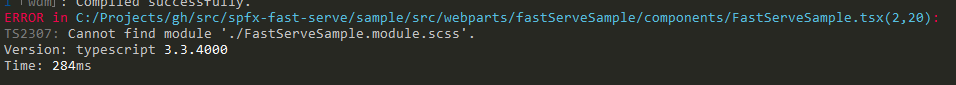

# FAQs / known issues <!-- omit in toc -->

- [1. When I run `npm run serve` I see the error](#1-when-i-run-npm-run-serve-i-see-the-error)
- [2. After I applied `sfpx-fast-serve` tool I have formatting broken in `gulpfile.js`](#2-after-i-applied-sfpx-fast-serve-tool-i-have-formatting-broken-in-gulpfilejs)
- [3. I added a new dependency in my solution (or started using new import from "@microsoft/*" modules) and now I see some strange errors](#3-i-added-a-new-dependency-in-my-solution-or-started-using-new-import-from-microsoft-modules-and-now-i-see-some-strange-errors)
- [4. Does it support React Hot Module Replacement (aka HMR)?](#4-does-it-support-react-hot-module-replacement-aka-hmr)
- [5. How to debug with Chrome Debugger extension from VSCode?](#5-how-to-debug-with-chrome-debugger-extension-from-vscode)
- [6. How to run with different locale?](#6-how-to-run-with-different-locale)

## 1. When I run `npm run serve` I see the error

> `ERROR in <Component>.tsx Cannot find module './<Component>.module.scss'`:



*a*. Try to explicitly change and then save any of `.tsx` files in the solution in order to trigger the build. Maybe the error will disappear automatically. If not, go to `#b`  

*b*. Check that you use `styles` variable in `.tsx` file. For example, if you have `import styles from './<Component>.module.scss';` and you don't have usages of `styles` in your `<Component>.tsx`, you will see the error. Simply delete unused import. If it's not the case, goto `#c`.  

*c*. Maybe you don't have `<Component>.module.scss.d.ts` which is generated automatically. Request generation by going to `<Component>.module.scss` and explicitly saving the file using `Ctrl+S` or just by changing something and saving. This should generate `<Component>.module.scss.d.ts` and fix the issue.

*d*. The last thing to check is whether your Component is actually used inside your codebase. If it's unused, then the corresponding `<Component>.module.scss.d.ts` will not be generated. To fix either include the component in your codebase using import statement or just run `fast-serve` from scratch (on the initial run it should ignore unused components).

If nothing above works, please raise an [issue](https://github.com/s-KaiNet/spfx-fast-serve/issues).

## 2. After I applied `sfpx-fast-serve` tool I have formatting broken in `gulpfile.js`

`sfpx-fast-serve` patches files and doesn't respect original file formatting (tabs vs whitespace, size, etc.). You have to fix it afterwards, if needed.

## 3. I added a new dependency in my solution (or started using new import from "@microsoft/*" modules) and now I see some strange errors

Every time you introduce a new dependency for your solution, you should re-run `npm run serve` command, so that it picks up all new dependencies correctly.

## 4. Does it support React Hot Module Replacement (aka HMR)?

HMR is supported, however considered as experimental. Please checkout config settings [option `hotRefresh`](../README.md#configuration-options).

## 5. How to debug with Chrome Debugger extension from VSCode?

Just refer to the official [documentation](https://docs.microsoft.com/en-us/sharepoint/dev/spfx/debug-in-vscode). The only difference is that instead of `gulp serve` you will use `npm run serve`

## 6. How to run with different locale?

You have two options here. If you support only one or two additional locales, you can create additional npm serve scripts (inside `package.json`) with different locales support, i.e.

```json
"serve-nl": "gulp bundle --custom-serve --locale=nl-nl --max_old_space_size=4096 && fast-serve",
```

Take a note that I added `--locale=nl-nl` to support NL locale.

Alternatively, if you need a lot of locales, you can create dynamic solution with environmental variables. To support this scenario, set a new environmental varable to be your locale code, i.e.

```bash
set SPFX_LOCALE=nl-nl
```

Then install [`cross-env`](https://www.npmjs.com/package/cross-env) npm module:

```bash
npm i cross-env --save-dev --save-exact
```

Then update npm script to use this variable:

```json
"serve-loc": "cross-env-shell NODE_OPTIONS=--max_old_space_size=4096 gulp bundle --custom-serve --locale=$SPFX_LOCALE && fast-serve"
```

Take a note on `--locale=$SPFX_LOCALE` special syntax and using `cross-env-shell` (part of `cross-env` package, you don't need to install anything additionally).
