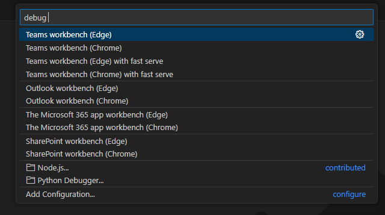

# How to integrate fast-serve with MS Teams Toolkit

1. Configure your SPFx solution with `fast-serve` like you normally do.
2. In the root of your MS Teams Toolkit project, open `.vscode/tasks.json` and add two tasks:

```json
  {
    "label": "Start Teams App with fast serve",
    "dependsOn": [
      "Validate prerequisites",
      "Provision",
      "fast serve"
    ],
    "dependsOrder": "sequence"
  }
```

and

```json
  {
    "label": "fast serve",
    "type": "shell",
    "command": "npx",
    "args": [
      "fast-serve"
    ],
    "problemMatcher": [
      {
        "pattern": [
          {
            "regexp": ".",
            "file": 1,
            "location": 2,
            "message": 3
          }
        ],
        "background": {
          "activeOnStart": true,
          "beginsPattern": "^.*Starting gulp.*",
          "endsPattern": "^.*Compiled successfully|webpack compiled.*"
        }
      }
    ],
    "isBackground": true,
    "options": {
      "cwd": "${workspaceFolder}/src"
    }
  },
```

By doing this we create fast-serve task config, which will be used by our launch configuration.

3. Open `.vscode/launch.json` and add two more commands under `compounds` array:

```json
  {
      "name": "Teams workbench (Edge) with fast serve",
      "configurations": [
          "Start Teams workbench (Edge)"
      ],
      "preLaunchTask": "Start Teams App with fast serve",
      "presentation": {
          "group": "forteams",
          "order": 3
      },
      "stopAll": true
    },
    {
      "name": "Teams workbench (Chrome) with fast serve",
      "configurations": [
          "Start Teams workbench (Chrome)"
      ],
      "preLaunchTask": "Start Teams App with fast serve",
      "presentation": {
          "group": "forteams",
          "order": 4
      },
      "stopAll": true
  },
```

Above code adds new configuration options for local debug scenarios.

4. Click on the MS Teams Toolkit extension in VSCode, under Environment select local -> debug. You will see two additional options:



Select the one you prefer.
